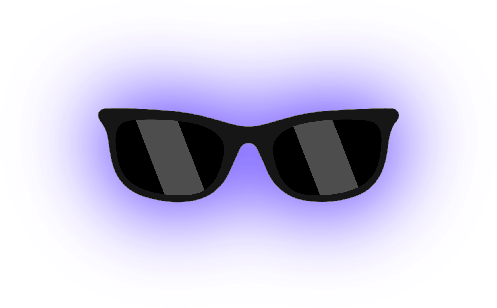
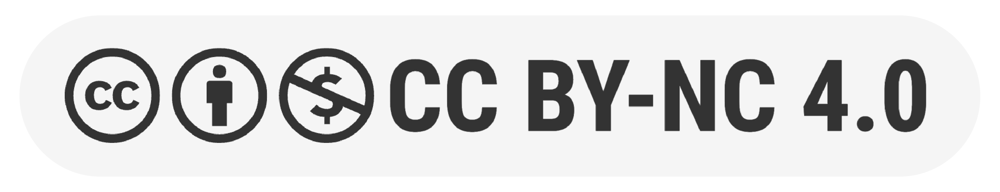

  <h1 align="center"> Through the Lens of Privacy</h1>
  

    <a href="https://zion-ziyang.github.io/">Ziyang&nbsp;Zhang</a>
    ·
    <a href="https://chobao.github.io/">Chong&nbsp;Bao</a>
    ·
    Xiaokun&nbsp;Pan
     
    <a href="https://chiamingchang.com/">Chia-Ming&nbsp;Chang</a>
    ·
    <a href="https://www-ui.is.s.u-tokyo.ac.jp/~takeo/">Takeo&nbsp;Igarashi</a>
    ·
    <a href="http://www.cad.zju.edu.cn/home/gfzhang/">Guofeng&nbsp;Zhang*</a>
  

  

     
  

<h2 align="center">CHI EA 2025</h2>

  

    This is the accompanying repository to the paper "Privacy: Exploring Privacy Protection in Vision-Language Model Interactions on Smart Glasses". The dataset will be released once the manuscript is published. For any questions, please feel free to contact the first author.
  

  

  <h2 align="center">Release plan</h2>
    

    <ul style="list-style-type: none; padding-left: 0; text-align: left;">
      <li>⬜ The whole dataset (including subset A & B)</li>
      <li>⬜ The code of the prototype system</li>
    </ul>
  

  

  

  <h2 align="center">License</h2>
    <h3 align="center"></h3>
  

